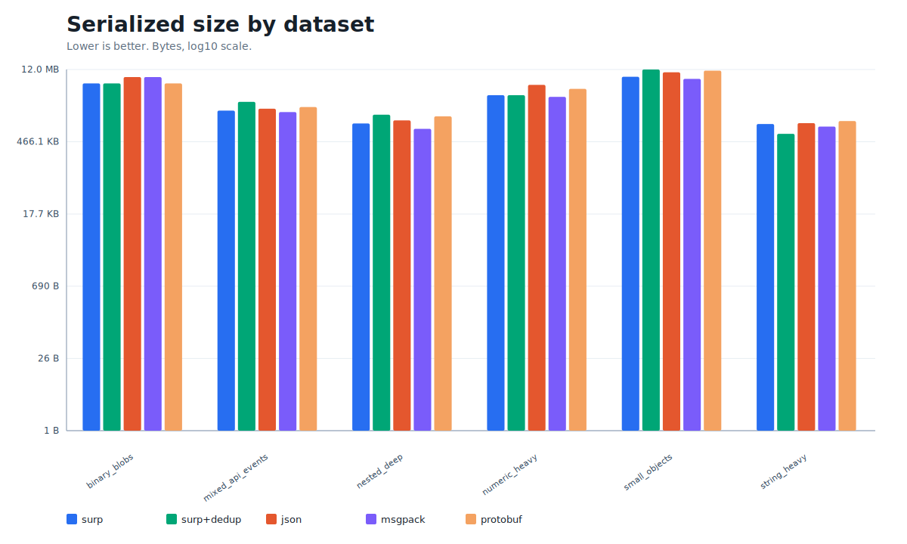
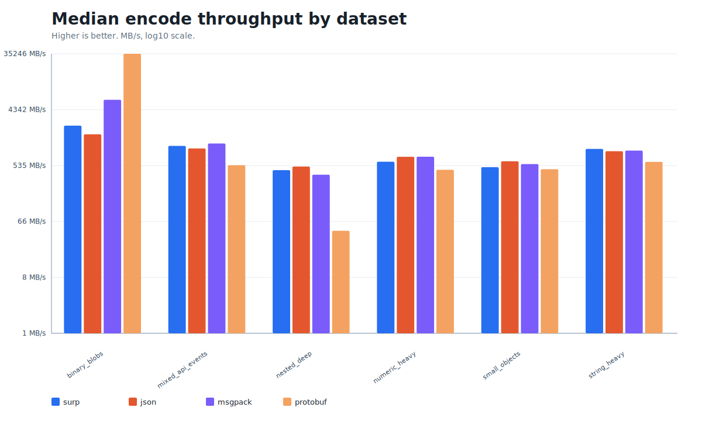
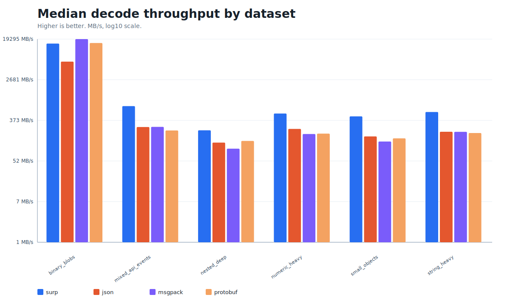

# Surp

Surp is a Rust-backed serialization toolkit with two related paths:

- **v1 Surp**: a stable block-framed binary format for schema-less values, with
  checksums, optional string deduplication, optional compression, a text
  notation, CLI tooling, Rust APIs, Python bindings, and C FFI.
- **RFC-001**: an additive next-generation implementation for CTN, CBF, and a
  baseline CQL path query engine. It is implemented under `surp_core::rfc001`
  and exposed in Python as `surp.rfc001`.

[](https://github.com/tubox-labs/surp/actions)
[](LICENSE-MIT)

## What You Get

- Compact binary encoding for nulls, booleans, integers, floats, strings,
  bytes, arrays, and ordered objects.
- Block-framed files with per-block XXH64 checksums and a trailer checksum.
- Zero-copy Rust decode for uncompressed v1 data through `SurpValue<'a>`.
- Owned Rust decode for all v1 data through `Value`.
- Human-readable v1 text notation for fixtures, debugging, and review.
- CLI commands for conversion, inspection, validation, simple benchmarks, and
  RFC-001 CTN/CBF/CQL workflows.
- Native Python package named `surp`, backed by PyO3 and `surp-core`.
- Python `surp.model` classes for RFC-001-native schema validation and CBF
  encode/decode flows.
- C ABI helpers for JSON-to-Surp and Surp-to-JSON buffers.
- Deterministic benchmark harnesses for release and regression testing.

## Status

Current release target: `v1.0.2`.

The v1 wire format remains the stable compatibility surface. RFC-001 is
additive and lives in a separate namespace; RFC-001 CBF files are not the same
wire format as v1 `.surp` files.

## Installation

### Rust Crates

Use the Rust API from crates.io:

```toml
[dependencies]
surp-core = "1.0.2"
surp-derive = "1.0.2"
```

For repository examples or local development, use path dependencies:

```toml
[dependencies]
surp-core = { path = "surp-core" }
surp-derive = { path = "surp-derive" }
```

### CLI From Source

```bash
git clone https://github.com/tubox-labs/surp.git
cd surp
cargo install --path surp-cli
surp --help
```

Run the CLI directly without installing:

```bash
cargo run -p surp-cli -- --help
cargo run -p surp-cli -- from-json examples/data/user.json -o /tmp/user.surp
cargo run -p surp-cli -- validate /tmp/user.surp
```

Compression is feature-gated:

```bash
cargo run -p surp-cli --features lz4 -- from-json data.json --compression lz4 -o data.surp
cargo run -p surp-cli --features zstd -- from-json data.json --compression zstd -o data.surp
cargo run -p surp-cli --features snappy -- from-json data.json --compression snappy -o data.surp
```

### Python Package

Install the native Python package:

```bash
pip install surp
```

Build it from this repository:

```bash
python -m venv .venv
source .venv/bin/activate
pip install maturin pytest mypy pyright
cd surp-python
maturin develop --release
python -m pytest tests/ -v
```

## Rust Quick Start

```rust
use surp_core::{Decoder, Encoder, Value};

fn main() -> surp_core::Result<()> {
    let value = Value::Object(vec![
        ("name".into(), Value::Str("Alice".into())),
        ("age".into(), Value::UInt(30)),
        ("active".into(), Value::Bool(true)),
    ]);

    let mut encoder = Encoder::new();
    encoder.encode_value(&value)?;
    let bytes = encoder.finish()?;

    let mut decoder = Decoder::new(&bytes);
    let decoded = decoder.decode_next()?.to_owned_value();
    assert_eq!(decoded, value);

    Ok(())
}
```

Useful Rust APIs:

- `Value`: owned v1 value tree.
- `SurpValue<'a>`: borrowed zero-copy v1 decode tree.
- `Encoder`: v1 encoder with limits, compression selection, and string dedup.
- `Decoder`: v1 decoder with checksum validation and resource limits.
- `surp_core::text::{parse, pretty_print}`: v1 text notation.
- `surp_core::rfc001`: RFC-001 CTN, CBF, and CQL implementation.
- `surp_derive::{Surp, SurpSchema}`: derive support for named Rust structs.

## Python Quick Start

```python
import surp

payload = {
    "name": "Alice",
    "age": 30,
    "active": True,
    "avatar": b"\x01\x02\x03",
}

data = surp.dumps(payload, dedup=True, sort_keys=True)
decoded = surp.loads(data)
assert decoded == payload

view = surp.loads_value(data)
assert view.kind == "object"
assert view["name"].value == "Alice"
assert view.as_python() == payload
```

Core Python API:

| API | Purpose |
| --- | --- |
| `dumps`, `loads` | Encode/decode one or more v1 values. |
| `dump`, `load` | File-like object helpers. |
| `encode`, `decode` | Compatibility aliases around default v1 encode/decode. |
| `encode_to_file`, `decode_from_file` | Path-based helpers. |
| `parse_text`, `pretty_print` | v1 text notation parsing and formatting. |
| `to_value`, `loads_value`, `parse_text_value` | Native-backed `SurpValue` views. |
| `Encoder`, `SurpDecoder` | Incremental encode/decode classes. |
| `surp.rfc001` | RFC-001 CTN/CBF/CQL helpers. |
| `surp.model` | RFC-001 class schema and validation layer. |

Supported Python values are `None`, `bool`, signed `int`, `float`, `str`,
`bytes`, `list`, `tuple`, and `dict` with string keys. Tuples decode back as
lists. `sort_keys=True` gives deterministic dictionary key order.

## CLI Usage

Convert JSON to v1 Surp:

```bash
surp from-json examples/data/user.json -o /tmp/user.surp
surp from-json examples/data/user.json --dedup -o /tmp/user-dedup.surp
```

Inspect and validate:

```bash
surp inspect /tmp/user.surp
surp validate /tmp/user.surp
surp validate /tmp/user.surp --strict
```

Convert back to JSON:

```bash
surp to-json /tmp/user.surp
surp to-json /tmp/user.surp --style compact -o /tmp/user.json
```

Use v1 text notation:

```bash
surp encode examples/data/user.surp.txt -o /tmp/user-from-text.surp
surp pretty /tmp/user-from-text.surp
surp decode /tmp/user-from-text.surp --indent 4 -o /tmp/user.surp.txt
```

Run a quick CLI benchmark:

```bash
surp bench examples/data/user.json -n 10000 --warmup 100
```

## v1 Text Notation

```surp
{
  id: 1001;
  name: "Alice";
  active: true;
  tags: ["admin", "ops"];
  settings: {
    theme: "dark";
    region: "us";
  };
  avatar: b64#AQID;
}
```

Implemented syntax includes objects, arrays, strings, base64 bytes, signed and
unsigned integers, floats, `inf`, `-inf`, `NaN`, `null`, booleans, optional
`::type` annotations, `//` line comments, and nested `/* ... */` block comments.

## Derive Usage

```rust
use surp_core::{Surp, SurpBytes};

#[derive(Debug, PartialEq, surp_derive::Surp, surp_derive::SurpSchema)]
struct Profile {
    #[surp(id = 1)]
    name: String,
    #[surp(id = 2)]
    age: u8,
    #[surp(id = 3)]
    avatar: SurpBytes,
}

fn main() -> surp_core::Result<()> {
    let profile = Profile {
        name: "Alice".into(),
        age: 30,
        avatar: SurpBytes::new(vec![1, 2, 3]),
    };

    let bytes = profile.to_surp_bytes()?;
    let decoded = Profile::from_surp_bytes(&bytes)?;
    assert_eq!(decoded, profile);
    Ok(())
}
```

Use explicit `#[surp(id = N)]` field IDs for stable schema evolution. Unknown
fields are skipped during derive-based decode.

## RFC-001 CTN, CBF, And CQL

RFC-001 is implemented under `surp_core::rfc001` and exposed through the CLI
and Python package. It is separate from the v1 `.surp` format.

Example CTN:

```ctn
@surp v1
@encoding cbf

let alice = User
  id = uid"550e8400-e29b-41d4-a716-446655440000"
  name = "Alice"
  role = 'Admin
  tags = ["admin", "ops"]
  settings = map<str, str> ["theme" => "dark", 'region => "us"]

&alice
```

CLI:

```bash
surp rfc-compile examples/data/user.ctn -o /tmp/user.crb
surp rfc-inspect /tmp/user.crb --ctn
surp rfc-query /tmp/user.crb ".tags[-1]"
```

Python:

```python
from surp import rfc001

ctn = """
User
  name = "Alice"
  tags = ["admin", "ops"]
  settings = map<str, str> ["theme" => "dark"]
"""

cbf = rfc001.compile_ctn(ctn, alignment=4)
decoded = rfc001.decode_cbf(cbf)
assert decoded["header"]["magic"] == "SURP"
assert rfc001.query_cbf(cbf, ".tags[-1]", as_ctn=True) == ['"ops"']
```

Implemented CQL selectors are `.field`, `[]`, `[index]`, negative indexes,
`['symbol]`, and `["string"]`.

## Python RFC Models

`surp.model` is a Python validation layer for RFC-001 CTN/CBF documents. It
uses Surp type markers rather than plain Python built-ins.

```python
from surp.model import Field, SurpModel, SurpSymbolEnum
from surp.model.types import Bool, Int64, MapOf, SeqOf, Str


class Role(SurpSymbolEnum):
    ADMIN = "Admin"
    VIEWER = "Viewer"


class User(SurpModel):
    name: Str = Field(required=True)
    age: Int64 = Field(required=False, default=0)
    active: Bool = Field(required=True)
    tags: SeqOf[Str] = Field(required=False, default_factory=list)
    settings: MapOf[Str, Str] = Field(required=False, default_factory=dict)
    role: Role = Field(required=True, default=Role.VIEWER)


user = User(name="Alice", active=True, tags=["admin"], role=Role.ADMIN)
ctn = user.to_ctn()
cbf = user.to_cbf()
surp_bytes = user.to_surp()
assert User.from_cbf(cbf) == user
assert User.from_surp(surp_bytes) == user
assert user.query_one(".name") == "Alice"
```

Useful exports include `SurpModel`, `SurpDocument`, `SurpSymbolEnum`,
`SurpVariant`, `SurpStream`, `Field`, `FieldInfo`, `annotation`, `registry`,
`generate_model_stubs`, and `write_model_stubs`.

## Workspace Layout

| Path | Purpose |
| --- | --- |
| `surp-core` | v1 codec, block framing, checksums, text notation, resource limits, RFC-001 modules. |
| `surp-derive` | `#[derive(Surp)]` and `#[derive(SurpSchema)]`. |
| `surp-cli` | `surp` command line tool. |
| `surp-python` | PyO3 extension and Python package named `surp`. |
| `surp-io` | Tokio framed IO, shared buffers, optional mmap reader. |
| `surp-compression` | Compression trait and optional zstd/lz4/snappy adapters. |
| `surp-ffi` | C ABI helpers. |
| `surp-simd` | Scalar-safe scanning helpers and optional aarch64 SIMD varint pre-scan. |
| `bench` | Rust and Python benchmark harnesses. |
| `examples` | Rust, Python, CLI, v1 text, and RFC-001 fixtures. |
| `docs` | Detailed API and implementation guides. |
| `fuzz` | cargo-fuzz targets and corpora. |

## Benchmarks

The release benchmark compares Surp, Surp with string deduplication, JSON,
MessagePack, CBOR, and Protocol Buffers across deterministic datasets. The
Protocol Buffers comparison uses a generic `Value` schema so it can represent
the same schema-less payloads as Surp and JSON.

Environment for the committed `v1.0.1` run:

- Mode: `full`
- Iterations per measurement: `10`
- OS/arch: `macos/aarch64`
- Rust: `rustc 1.94.1`
- Output: `docs/assets/bench/v1.0.1`

Charts:







Size summary from the same run:

| Dataset | Surp | Surp+Dedup | JSON | MsgPack | Protobuf | Surp/JSON |
| --- | ---: | ---: | ---: | ---: | ---: | ---: |
| small_objects | 8.6 MB | 12.0 MB | 10.5 MB | 7.8 MB | 11.4 MB | 0.82x |
| string_heavy | 1.0 MB | 668.3 KB | 1.1 MB | 925.8 KB | 1.2 MB | 0.96x |
| nested_deep | 1.0 MB | 1.5 MB | 1.2 MB | 835.1 KB | 1.4 MB | 0.87x |
| binary_blobs | 6.4 MB | 6.4 MB | 8.5 MB | 8.5 MB | 6.4 MB | 0.75x |
| mixed_api_events | 1.9 MB | 2.8 MB | 2.0 MB | 1.7 MB | 2.2 MB | 0.92x |
| numeric_heavy | 3.7 MB | 3.7 MB | 6.0 MB | 3.5 MB | 5.0 MB | 0.63x |

Run the Rust benchmark yourself:

```bash
cargo run -p surp-bench --release -- --mode ci --output bench/results
cargo run -p surp-bench --release -- --mode full --output bench/results/full
```

The harness writes `raw.json`, `summary.csv`, `regression_report.md`,
`size_comparison.md`, `system_info.json`, and SVG charts.

Run the Python benchmark:

```bash
cd surp-python
maturin develop --release
cd ..
python3 bench/python/bench_surp.py --mode ci --output bench/results/python
```

## Local Development

Prerequisites:

- Rust toolchain with edition 2024 support. The workspace MSRV is `1.85.0`.
- Python 3.9 or newer for the native package.
- `maturin` and `pytest` for Python development.
- Optional: nightly Rust and `cargo-fuzz` for fuzzing.

Recommended loop:

```bash
cargo fmt --all
cargo test --workspace --all-features
cargo clippy --workspace --all-features -- -D warnings
```

Python loop:

```bash
cd surp-python
maturin develop --release
python -m pytest tests/ -v
python -m mypy python/surp
pyright python/surp
```

CLI smoke:

```bash
cargo run -p surp-cli -- from-json examples/data/user.json -o /tmp/user.surp
cargo run -p surp-cli -- validate /tmp/user.surp
cargo run -p surp-cli -- to-json /tmp/user.surp --style compact
cargo run -p surp-cli -- rfc-compile examples/data/user.ctn -o /tmp/user.crb
cargo run -p surp-cli -- rfc-query /tmp/user.crb ".tags[]"
```

Fuzz smoke:

```bash
cd fuzz
cargo +nightly fuzz run fuzz_decode -- -max_total_time=30 -max_len=4096
cargo +nightly fuzz run fuzz_roundtrip -- -max_total_time=30 -max_len=4096
cargo +nightly fuzz run fuzz_text -- -max_total_time=30 -max_len=4096
cargo +nightly fuzz run fuzz_varint -- -max_total_time=30 -max_len=4096
cargo +nightly fuzz run fuzz_block -- -max_total_time=30 -max_len=4096
```

## Release Checklist

```bash
cargo fmt --all -- --check
cargo test --workspace --all-features
cargo clippy --workspace --all-features -- -D warnings
cd surp-python
maturin develop --release
python -m pytest tests/ -v
cd ..
cargo run -p surp-bench --release -- --mode full --output docs/assets/bench/v1.0.2 --version v1.0.2
git tag v1.0.2
gh release create v1.0.2 --title "Surp v1.0.2" --notes-file .github/releases/v1.0.2.md
```

## More Documentation

- [CLI guide](docs/CLI.md)
- [Rust API](docs/RUST_API.md)
- [Python API](docs/PYTHON_API.md)
- [Examples](docs/EXAMPLES.md)
- [v1 format spec](docs/SPEC.md)
- [RFC-001 implementation](docs/RFC-001-IMPLEMENTATION.md)
- [Design risks](DESIGN_RISKS.md)
- [Security policy](SECURITY.md)

## License

Licensed under either of:

- Apache License, Version 2.0 ([LICENSE-APACHE](LICENSE-APACHE))
- MIT license ([LICENSE-MIT](LICENSE-MIT))

at your option.
